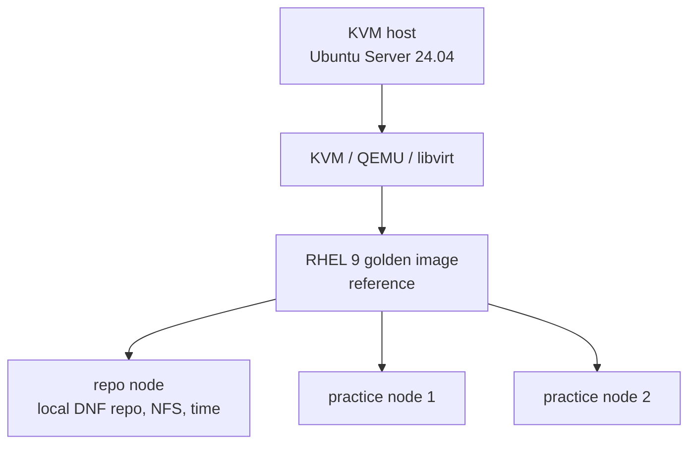
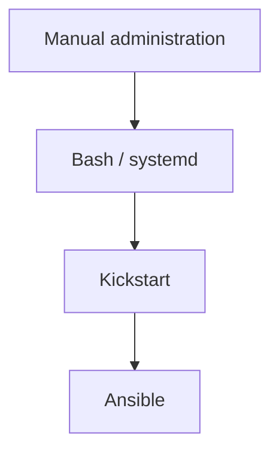

# Architecture

The lab runs on a single physical KVM host and is intentionally kept small.

The goal is to have an environment that is easy to understand, break, rebuild
and progressively automate.

## Host

A small x86 mini-PC with:

- quad-core CPU with hardware virtualization
- 16 GB RAM
- local SSD
- wired network connection

It runs **Ubuntu Server 24.04 LTS** and acts as both the hypervisor and
administration point.

## Virtualization

- **KVM / QEMU / libvirt**
- `virsh` and Cockpit for management
- libvirt default NAT network
- QCOW2 disks stored locally on SSD

## Storage

The local SSD holds the VM disks for better I/O performance.

A NAS is used for cold data such as:

- installation media
- backups
- templates

## Virtual machines

A clean **RHEL 9 golden image** is used as the reference for the lab.

Linked QCOW2 clones are then created from it:

The golden image itself is built and maintained in:

[rhel-golden-image](https://github.com/lxrider/rhel-golden-image)

## Design choices

### Golden image + linked clones

Keep one clean reference image and create lightweight disposable lab nodes from it.

Less disk usage, faster rebuilds, less configuration drift.

### Kickstart

The RHEL image is installed unattended with Kickstart.

The build process is reproducible and version-controlled rather than dependent
on a manually installed VM.

### Progressive automation

I prefer understanding each layer before automating it.

### Keep the reference image clean

The golden image stays close to a clean RHEL installation.

Hardening and configuration are applied separately so that their purpose and
impact remain visible.

## Public repository

This is a public lab.

Real hostnames, addresses, credentials and secrets are not committed.
Published examples are generalized when necessary.
