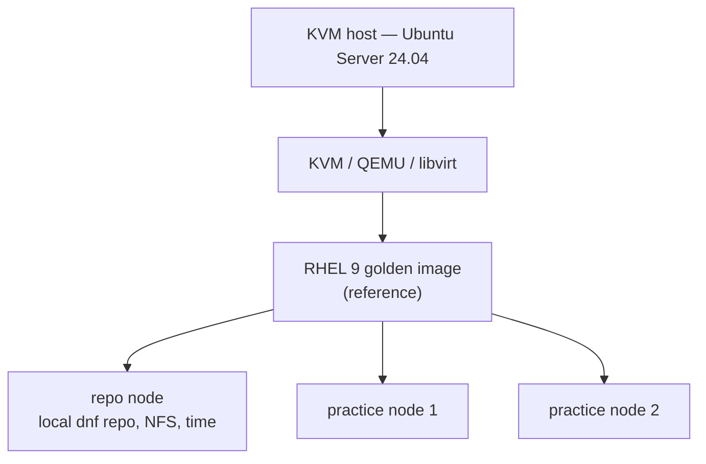

# Lab Architecture

A single physical host acts as a KVM hypervisor for an isolated virtual lab
dedicated to RHCSA/RHCE practice.

## Host

A small-form-factor x86 mini-PC (NUC-class): a quad-core CPU with hardware
virtualization, 16 GB of RAM and a local SSD. It runs Ubuntu Server 24.04 LTS
and serves as both hypervisor and administration point. A wired network
connection is assumed.

## Virtualization

- **Stack** — KVM / QEMU / libvirt, managed with `virsh` and Cockpit.
- **Networking** — virtual machines attach to libvirt's default NAT network.
- **Disks** — QCOW2 images stored on the local SSD.

## Storage

- The local SSD hosts the VM disks, for I/O performance.
- A NAS holds cold data: installation media, backups and templates.

## Virtual machines

One RHEL 9 golden image — a pristine reference kept close to a stock
installation — is cloned into a small RHCSA topology.

## Key design choices

- **Golden image + linked QCOW2 clones** — minimal disk footprint, fast rebuilds.
- **Kickstart-driven builds** — unattended, reproducible, version-controlled.
- **Progressive automation** — Bash → systemd → Kickstart → Ansible.
- **Security by separation** — the reference image stays pristine; hardening
  lives in a dedicated repository.

## Privacy

This is a public repository. Real hostnames, addresses and secrets are never
committed — they are generalized in every published file.
